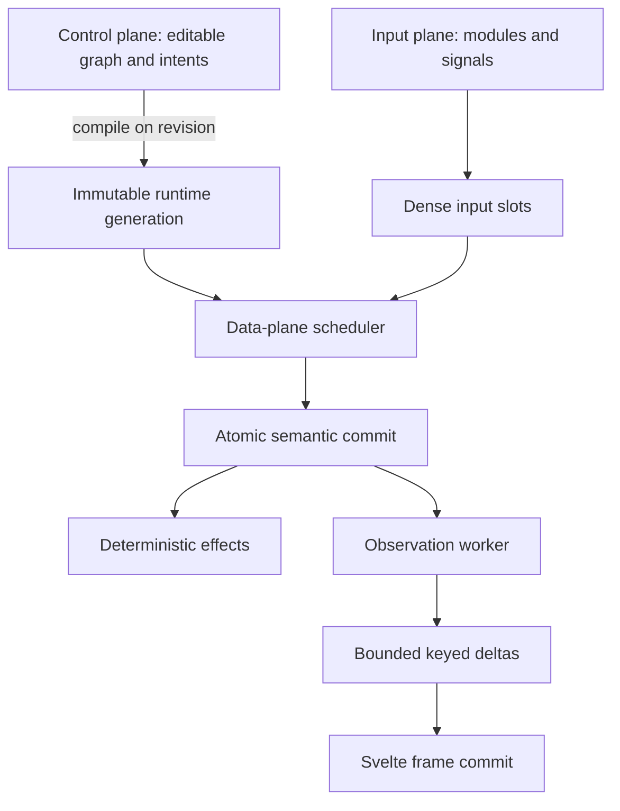

# Chataigne2 Runtime and UI Performance Foundation Plan

## Revised diagnosis

The 50 non-multiplexed action result materially changes the priority: multiplexing is not the primary bottleneck. It adds lane cost, but a large fixed cost already exists per processor and per engine tick.

The strongest confirmed issue is this sequence:

1. A changing signal marks state-machine inputs dirty.
2. `StateMachineManager::update_requires_tree_snapshot()` requests a tree snapshot.
3. `golden_core` builds that snapshot before scheduled updates.
4. Building it iterates and clones data from the entire node store.
5. The manager then scans active states/processors, rebuilds its context provider, prepares fresh runtime inputs, evaluates processors, and prepares observation data.
6. Transport intents concurrently wait for the same engine mutex.

See the current [snapshot requirement](https://github.com/Golden-Geek/Chataigne2/blob/47db61c27994433621012af503da33558491e3b5/src/state_machine_nodes/manager.rs#L1099-L1111), [scheduled snapshot creation](https://github.com/Golden-Geek/golden_core/blob/b3453b4aa6338f7ea22084e6813f43de1a1f9c25/crates/core/src/engine/runtime/scheduled_updates.rs#L29-L35), and [full snapshot construction](https://github.com/Golden-Geek/golden_core/blob/b3453b4aa6338f7ea22084e6813f43de1a1f9c25/crates/core/src/engine/mod.rs#L709-L748).

Fifty actions increase the editable node graph substantially even though they represent only 50 runtime lanes. That explains why they can reproduce the multiplex fixture’s slowdown.

The current Stage 1 correction should therefore be replaced by a broader runtime-foundation correction. Further local optimization inside `manager.rs` is insufficient.

## Target architecture

The editable node graph must cease being the real-time execution structure.



The four planes have different guarantees:

| Plane       | Responsibility                                          | Guarantee                           |
| ----------- | ------------------------------------------------------- | ----------------------------------- |
| Control     | Graph edits, history, persistence, compilation requests | Ordered and lossless                |
| Input/data  | Signals, conditions, formulas, state, effects           | Deterministic and deadline-oriented |
| Observation | Runtime previews, diagnostics, selected-lane inspection | Bounded and latest-wins             |
| UI          | Intents, keyed stores, visible rendering                | Frame-coherent and responsive       |

## Non-negotiable invariants

After warm-up, a value-only tick must have:

* Zero complete `ProcessTreeSnapshot` builds.
* Zero editable-tree traversal.
* Zero topology, context-schema or binding reconstruction.
* Zero formula or condition recompilation.
* Zero JSON serialization on the engine or semantic worker threads.
* Zero string formatting, `NodeId` lookup or declaration-string dispatch per lane.
* Zero heap allocations proportional to processor or lane count.
* Zero transport acquisition of an engine-wide mutex.
* Observation work proportional to changed visible values, not project size.
* One shared source value stored once, not cloned into every processor input map.
* Identical formulas compiled once and shared by all instances.
* Deterministic semantic results and effect ordering across worker counts.
* Explicit bounded queues with different policies for state values, triggers, intents and previews.

## Phase 0 — Establish truthful qualification

**Supercommit:** performance fixtures, instrumentation and frozen baseline only.

> **Implementation status (2026-07-10): in progress.** The first Phase 0 slice registers
> the two canonical workloads in `benchmarks/aaa/fixtures.v1.json` and enforces their
> observed processor/shared-input topology through the normal sparse project load/save
> path. The checked-in multiplex project has the required five processors and is marked
> `topology_only`. The reported many-actions project has 49 processors, not the required
> 50, so `P50-L1` remains explicitly `fixture_pending`. No timing or semantic qualification
> is claimed by this slice; completing that topology, deterministic source driving,
> semantic digests, observation modes, manipulation concurrency, distribution capture,
> and the frozen environment baseline remain required before Phase 0 can complete.

### Canonical fixtures

Commit both reported cases as permanent qualification fixtures:

| Fixture   | Exact topology                                                                                                           |
| --------- | ------------------------------------------------------------------------------------------------------------------------ |
| `P50-L1`  | 50 active non-multiplexed actions, one InputValue condition each, one changing shared Signal, no formula outputs/effects |
| `P5-L127` | 5 active actions, 127 multiplex lanes each, InputValue compared with lane-specific list values                           |

Each fixture must:

* Use a deterministic changing source crossing comparison thresholds.
* Produce a per-tick semantic digest.
* Assert expected processors and lanes were evaluated.
* Keep input-only conditions observable to the benchmark so dead-code elimination cannot fake success.
* Exercise real application configuration, not a `cfg(test)` fast path.
* Run with preview disconnected, connected-hidden, one selected lane, and a visible editor.
* Run concurrently with continuous manipulation intents.

Add companion correctness cases for:

* steady comparators;
* rising/falling transitions;
* `value_changed`;
* toggle mode;
* speed comparisons;
* context resize;
* state activation/deactivation;
* generation replacement while active.

### Scaling matrix

Measure processor and lane costs independently:

* Processor sweep: `1, 5, 10, 25, 50, 100, 500, 1,000` processors × one lane.
* Lane sweep: `1, 8, 32, 127, 512, 1,024, 4,096` lanes × one and five processors.
* Constant-work comparison: `635×1`, `127×5`, `5×127`, `1×635`.
* Dirty ratios: `0%`, `1%`, `10%`, `100%`.
* Shared input versus independent inputs.

Fit and publish:

[
T =
T_0 +
P C_{\text{processor}} +
L C_{\text{lane}} +
D C_{\text{dirty}} +
V C_{\text{visible}} +
B C_{\text{bytes}} +
T_{\text{contention}}
]

This prevents a multiplex improvement from hiding unchanged fixed processor cost.

### Instrumentation

Carry correlated revisions from source write through paint:

```text
source → semantic tick → commit → preview → transport → store → paint
```

Record non-overlapping timings and work counters for:

* snapshot construction and cloned nodes/bytes;
* active processor discovery;
* context and binding preparation;
* condition preparation/evaluation;
* formula preparation/evaluation;
* effects;
* preview projection;
* DTO conversion and serialization;
* queue depths and coalescing;
* engine-lock wait/hold;
* transport delivery/decode;
* Svelte store application;
* browser task and paint time;
* intent receipt, acceptance, application and painted feedback;
* allocation count and allocated bytes.

The current ignored two-processor benchmark with 30 samples is useful diagnostic work, but it cannot qualify p99, real transport, Svelte or paint. Replace it with PR, nightly and release tiers.

### Exit gate

* Both reported failures reproduce from checked-in fixtures.
* Semantic digests are stable across debug/release and 1/2/4/8 workers.
* At least 95% of tick time is assigned to named phases.
* Machine-readable baseline, environment manifest and profiles are committed.

## Phase 1 — Remove shared engine ownership from transport

**Owning layer:** `golden_core`.

Replace `Arc<Mutex<Engine<T>>>` as the host interaction boundary with a sole-owner engine actor.

The current WebSocket intent handler waits for the engine lock, applies the intent, and collects events before releasing it. See [`ui_server.rs`](https://github.com/Golden-Geek/golden_core/blob/b3453b4aa6338f7ea22084e6813f43de1a1f9c25/crates/transport_server/src/ui_server.rs#L1111-L1150).

### Introduce

* `EngineHandle`: cloneable command sender, with no direct engine access.
* `EngineCommand`: validated control-plane command.
* `CommandReceipt`: immediate acceptance/rejection result.
* `AppliedAck`: ordered notification that the authoritative graph applied the command.
* Immutable `UiReadModel` publications that transport can read without engine access.
* Separate bounded priority queues for edits, runtime ingress and background work.

### Queue semantics

| Message                | Policy                                                                      |
| ---------------------- | --------------------------------------------------------------------------- |
| Structural edits       | Lossless and ordered; reject explicitly when capacity is exhausted          |
| Begin/end edit session | Lossless and ordered                                                        |
| Triggers/commands      | Lossless and ordered                                                        |
| Drag/value updates     | Coalescible within the same client edit session, preserving the final value |
| Observation interests  | Latest request per client/view                                              |
| Preview frames         | Latest-wins                                                                 |
| Diagnostics            | Bounded with counters for suppressed duplicates                             |

The UI should distinguish “accepted” from “applied.” Raising the existing four-second timeout is forbidden.

### Exit gate

* Transport never locks the engine.
* Accepted acknowledgement p95 ≤ 2 ms and p99 ≤ 5 ms, even during an artificially stalled semantic workload.
* Applied acknowledgements preserve total ordering.
* Zero intent timeouts in both canonical fixtures.
* No reliable command is silently dropped.
* Slow or disconnected clients cannot delay control-plane progress.

## Phase 2 — Create the final observation and UI data plane

**Owning layers:** `golden_core`, `golden_ui`, Chataigne UI.

The current manager reconstructs a complete `StateMachineProtocolBundle` and emits it as a custom event from the engine callback. See [`publish_output_preview()`](https://github.com/Golden-Geek/Chataigne2/blob/47db61c27994433621012af503da33558491e3b5/src/state_machine_nodes/manager.rs#L1768-L1806).

This must be replaced, not throttled.

### Backend protocol

Separate static metadata from dynamic observation:

```rust
RuntimeCatalogSnapshot {
    generation,
    processors,
    lane_catalog,
    output_catalog,
}

RuntimePreviewDelta {
    generation,
    sequence,
    semantic_tick,
    changed_outputs,
    changed_lane_summaries,
    selected_inspections,
    removed_keys,
}
```

Requirements:

* Rust remains the protocol source of truth; generate TypeScript.
* Processor/formula metadata publishes only when its structural revision changes.
* Runtime previews no longer enter the reliable graph event log.
* The observation worker reads immutable committed runtime buffers.
* DTO projection and serialization run outside control and semantic threads.
* Interest state is per client and per view.
* Only visible nodes, selected lane details and explicitly subscribed history are projected.
* Each client/view keeps at most one pending supersedable delta.
* Sequence/base-generation mismatch requests a targeted observation resync, not a whole graph resync.

### Svelte 5 frontend

Replace whole-bundle consumption with focused keyed stores:

* output previews by stable preview key;
* lane summaries by `(processor, context)`;
* inspections by `(processor, context)`;
* processor metadata by structural generation.

Apply received deltas to a staging map and commit once per `requestAnimationFrame`. All components in a frame then observe one coherent semantic revision.

Also:

* Remove `syncProcessorInspectorInterest()` from read/resolver functions.
* Manage interests in explicit component lifecycle effects.
* Eliminate repeated `.filter()` and `.find()` scans over complete lane arrays.
* Virtualize large processor/lane lists.
* Do not instantiate subscriptions for hidden panels.

### Exit gate

* No full processor/lane bundle is emitted for a value-only change.
* Preview bytes scale with changed visible records.
* At 100,000 active values and 200 visible values, payload is initially capped at 64 KiB per frame.
* Browser main-thread p95 ≤ 4 ms and p99 ≤ 8 ms.
* Zero tasks exceeding 50 ms during a ten-minute fixture.
* Visible revision age is at most one frame p95 and two frames p99.
* UI remains interactive when the observation worker or client is deliberately slowed.

## Phase 3 — Compile an immutable runtime generation

**Owning layers:** generic runtime-system interface in `golden_core`; Chataigne compiler in the app/state-machine layer.

The `StateMachineManager` node must stop being a periodic interpreted runtime.

### Compile on structural revisions

Create:

```rust
CompiledStateMachine {
    generation,
    state_program,
    processor_instances,
    shared_kernels,
    input_routes,
    context_catalog,
    lane_layouts,
    state_layout,
    effect_layout,
    observation_catalog,
}
```

Compilation occurs only when relevant structure changes:

* formula topology;
* condition topology;
* processor creation/removal;
* context schema or membership;
* bindings/control modes;
* state-machine topology.

A signal value change does not compile or inspect graph structure.

### Runtime generation lifecycle

* Compile a replacement generation asynchronously.
* Continue executing the current valid generation while compilation runs.
* Atomically swap generations at a semantic tick boundary.
* Migrate compatible state through stable typed keys.
* Preserve lane state for context-key intersections during context resize.
* Initialize genuinely new state explicitly.
* Emit diagnostics for incompatible state rather than silently coercing it.
* Never pause the UI while compiling.

### Direct input routing

At compilation, resolve graph references into stable `InputSlot`s and a dependency table.

A signal update becomes:

```text
slot write → generation increment → dependent dirty bits
```

No processor tree scan or fresh `RuntimeInputSnapshot` is allowed.

The shared Signal in both fixtures occupies one input slot. All dependent programs reference it without cloning its value.

### Remove steady-state snapshots

After cutover:

* `StateMachineManager::update_requires_tree_snapshot()` is false for runtime value processing.
* The manager does not run as a periodic 60 Hz node interpreter.
* Editable graph snapshots are used only for compilation and rare structural operations.
* The data plane contains no live `NodeStore` or snapshot reference.

### Exit gate

For value-only ticks after warm-up:

* `snapshot_builds == 0`;
* `snapshot_nodes_cloned == 0`;
* `topology_node_visits == 0`;
* `context_rebuilds == 0`;
* `binding_rebuilds == 0`;
* `compilations == 0`.

`P50-L1` must sustain 60 Hz in the real debug application before proceeding.

## Phase 4 — Compile the complete processor, including conditions

**Owning layers:** `golden_alchemist_core` for reusable compiled execution; Chataigne state-machine layer for condition semantics and processor compilation.

Conditions, formula inputs and formula execution must become one program rather than two runtimes joined by dynamic maps.

### Target representation

```rust
CompiledProcessorKernel {
    condition_ops,
    formula_ops,
    dependency_map,
    input_layout,
    property_layout,
    state_layout,
    output_layout,
    effect_layout,
    observation_descriptors,
}

ProcessorInstance {
    kernel,
    property_block,
    lane_range,
    state_range,
    output_range,
}
```

### Condition compilation

Compile InputValue and condition-group nodes into typed operations:

* load input slot;
* load lane/context value;
* projection;
* typed comparator;
* transient/toggle/speed state;
* boolean reduction;
* gate or trigger output.

Resolve comparator strings, child declarations, references, projections and context links once during compilation.

The steady-state condition loop must not contain:

* `NodeId` traversal;
* `decl_id` lookup;
* string comparator dispatch;
* `ParamValue` cloning;
* `StableRef` construction;
* `HashMap` lookup;
* context-key string formatting;
* JSON or DTO code.

### Dense data layout

Use typed, reusable storage:

* scalar/vector/color input columns;
* current and previous generations;
* condition-state columns;
* formula state arena;
* dirty bitsets;
* output columns;
* effect buffers.

Context keys and labels are catalog metadata, not execution values.

### Shared compilation

The 50 identical actions must share one compiled kernel. Only instance properties and state differ.

The five 127-lane actions should therefore represent:

* one shared kernel;
* five instances;
* 635 dense lane records;
* one shared Signal slot;
* shared immutable context/list storage where applicable.

### Allocation policy

After warm-up:

* semantic evaluation performs no heap allocations;
* scratch buffers retain capacity;
* output/effect regions are preassigned;
* changed-value lists reuse storage;
* observation allocation depends only on selected visible records.

### Liveness

Compile away semantically dead formula work when it has no effects, state dependency, output consumer or observation interest. However, qualification fixtures must verify condition results through a digest so liveness analysis cannot skip required work and claim a false improvement.

### Exit gate

* Full correctness corpus matches the legacy semantic digest.
* `P50-L1` release semantic p95 ≤ 2 ms and p99 ≤ 4 ms.
* `P5-L127` release semantic p95 ≤ 4 ms and p99 ≤ 6 ms.
* Real debug application sustains at least 59.5 Hz over 60 seconds.
* No allocation grows with processor or lane count.
* Identical formula/kernel compilation count is one.

## Phase 5 — Add a deterministic batch scheduler

**Owning layers:** `golden_core` runtime facilities and `golden_alchemist_core` execution kernels.

Do not run independent nested Rayon jobs from each processor.

### Scheduler design

* Persistent worker pool initialized before runtime begins.
* Group work by shared compiled kernel.
* Batch multiple one-lane processors together.
* Divide large lane ranges into coarse contiguous chunks.
* Choose serial versus parallel execution from measured workload, not only lane count.
* Use dirty processor and lane bitsets.
* Select sparse or dense execution based on dirty density.
* Workers write into isolated preassigned state/output regions.
* No worker mutates the editable engine.
* No result sorting is necessary: output ranges encode deterministic order.

### Deterministic commit

Effects are staged with compile-time ordering coordinates:

```text
state order → processor order → lane index → effect index
```

Commit them after computation in that order regardless of worker completion order.

Continuous values may be coalesced before a tick according to their declared input semantics. Triggers, commands and edge events remain lossless and ordered.

### Overload behavior

* Never silently skip semantic work.
* Expose missed-deadline and backlog counters.
* Keep queues bounded.
* Observation may drop superseded frames.
* UI/control processing remains responsive because it is on another plane.
* Output and trigger loss are never used as a performance escape hatch.

### Exit gate: 100,000 active comparisons

Define the initial 100,000 claim precisely as active scalar InputValue comparisons with a changing shared scalar and precompiled references.

Test:

* `100 × 1,000`;
* `1,000 × 100`;
* `10,000 × 10`;
* 100,000 stored with 1% dirty;
* 100,000 stored with none dirty.

Required release results on named reference hardware:

| Case                                |                              Gate |
| ----------------------------------- | --------------------------------: |
| 100,000 dense comparisons           |           p95 ≤ 8 ms; p99 ≤ 12 ms |
| 1% sparse update                    |                        p95 ≤ 2 ms |
| No dirty values                     |                      p95 ≤ 0.5 ms |
| Missed 16.67 ms deadlines           |                        Below 0.1% |
| Cross-worker semantic/effect digest |                         Identical |
| UI with 200 visible values          | 60 Hz; p95 input-to-paint ≤ 33 ms |
| Intent timeouts                     |                              Zero |

This does not claim that arbitrary formulas containing expensive scripts or IO can execute 100,000 times inside 8 ms. Each operation class needs a measured cost budget. It does establish the data-oriented foundation needed for hundreds of thousands of ordinary values.

## Phase 6 — Cut over and delete the legacy path

Dual execution is permitted only in test shadow mode for semantic comparison.

Once the gates pass:

* Make compiled runtime generations the only production path.
* Delete interpreted condition traversal from steady state.
* Delete per-tick context-provider reconstruction.
* Delete fresh per-processor `RuntimeInputSnapshot` construction.
* Delete the full runtime-preview bundle path.
* Remove engine-owned runtime-view interests.
* Remove the production feature flag for the old runtime.
* Split the current manager into cohesive compiler, runtime adapter, effect and observation modules, each under the repository size guideline.
* Document ownership and runtime invariants.
* Run root and `golden_core` formatting and complete cross-platform tests.

No permanent compatibility layer should remain.

## Final qualification

### Real application gates

| Metric                          |             Release |   Debug/development |
| ------------------------------- | ------------------: | ------------------: |
| `P50-L1` semantic tick p95/p99  |            ≤ 2/4 ms |           ≤ 8/12 ms |
| `P5-L127` semantic tick p95/p99 |            ≤ 4/6 ms |          ≤ 12/16 ms |
| Sustained engine frequency      |           ≥ 59.5 Hz |           ≥ 59.5 Hz |
| Intent accepted p95/p99         |            ≤ 2/5 ms |           ≤ 5/10 ms |
| Intent applied p95/p99          |       ≤ 16.67/33 ms |         ≤ 33/100 ms |
| Visible input-to-paint p95/p99  |          ≤ 33/50 ms |         ≤ 50/100 ms |
| Intent timeouts                 |                Zero |                Zero |
| Browser tasks over 50 ms        | Zero in ten minutes | Zero in ten minutes |

### CI levels

Every PR:

* semantic digests;
* short processor/lane matrix;
* both canonical absolute gates;
* allocation/work-counter regression;
* failure for unexplained regression over 5% outside the noise band.

Nightly:

* complete scaling matrix;
* 100,000 dense/sparse/idle;
* production frontend through Playwright;
* continuous manipulation;
* slow-client and reconnect tests;
* 1/2/4/8 worker determinism;
* Linux, Windows and macOS.

Release candidate:

* five randomized repetitions;
* ten-minute latency distributions;
* at least eight-hour soak;
* bounded engine and browser memory;
* RSS growth below 1 MiB/hour after warm-up;
* stable queue high-water marks;
* no timeout, semantic mismatch, deadlock, panic or lost non-coalescible event.

## Benchmark integrity rules

Qualification must never be achieved by:

* increasing intent timeouts;
* lowering preview frequency;
* disabling visible runtime feedback;
* testing only headless execution;
* moving work to a queue without draining it;
* omitting processors or lanes;
* dead-code-eliminating the fixture’s asserted results;
* using a special benchmark-only execution path;
* comparing averages without p95/p99;
* using 30 samples to claim p99;
* allowing a drifting baseline to normalize regressions.

Every phase ends with:

1. The progress document updated with work completed and measured evidence.
2. Machine-readable before/after results.
3. A focused supercommit in each affected repository/submodule.
4. The Chataigne2 root supercommit updating all corresponding submodule pointers.
5. No phase marked complete before its exit gate passes.

The immediate next move should be Phase 0—not another local optimization to `manager.rs`. The 50-action fixture proves the execution boundary itself must change.
